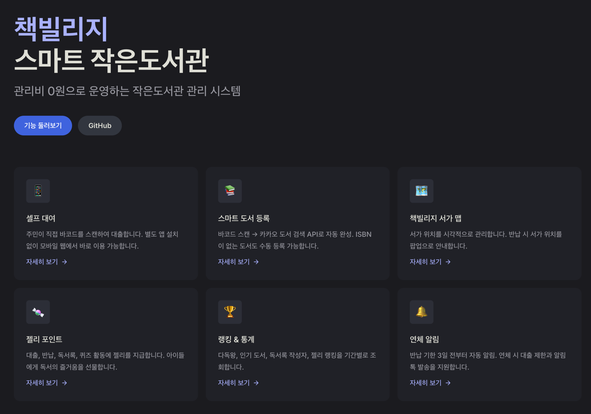

<p align="center">
  
</p>

# 책빌리지 (Book Village) — 작은도서관 도서 대여 관리 프로그램

# versions

### v0.1 — 최초 커밋


## 소개 
> 관리비 0원으로 운영하는 작은도서관 도서 대출/반납 관리 시스템

아파트, 학교, 마을 작은도서관을 위한 **무료 오픈소스 도서관 관리 프로그램**입니다. 바코드 스캔으로 도서 대여/반납, 도서 검색, 연체 관리, 독서 퀴즈, 독서록까지 — 스마트폰 하나로 도서관을 운영할 수 있습니다.


## 테스트 접속 주소 
**테스트 URL**: https://bookvillage-dev.vercel.app

| 구분 | 접속 경로 | 아이디 | 비밀번호 |
|------|----------|--------|---------|
| 주민 | `/login` | 010-1234-1234 | 2022 |
| 관리자 | `/admin/login` | admin | admin1234 |

상세 기능 안내와 가이드는 [문서 사이트](https://dean-studio.github.io/bookvillage_app/)에서 확인할 수 있습니다.



## 왜 만들었나요?

> *"관리할 사람이 없어서 닫히는 도서관이 하나라도 줄었으면 합니다."*

아이를 키우면서 동네 작은도서관을 자주 찾습니다. 그런데 사람이 없어 문을 닫거나, 운영을 포기하는 곳이 점점 늘어나고 있었습니다.

수기 장부, 엑셀 대장, 수작업 연체 관리... **아날로그 방식의 도서관 운영은 자원봉사자에게 너무 큰 부담**입니다. 결국 지치고, 포기하게 됩니다.

하지만 **아이들에게 도서관은 특별한 공간**입니다. 책을 직접 만지고, 고르고, 읽는 경험은 어떤 디지털 콘텐츠로도 대체할 수 없습니다. 이 공간이 사라지는 건 너무 아까운 일이었습니다.

그래서 직접 만들었습니다.

- **스마트폰 하나면 충분합니다** — 누구나 사서가 될 수 있고, 주민은 셀프 대여까지 가능합니다
- **관리비 0원** — Vercel + Supabase 무료 플랜으로 운영비가 들지 않습니다
- **아이들이 즐거워합니다** — 독서 퀴즈를 풀고, 독서록을 쓰고, 젤리 포인트를 모으며 "오늘 젤리 몇 개 모았어!" 하고 좋아합니다

---

### 함께 도서관을 살려요

**이 프로젝트는 동네 작은 도서관이 더 오래 운영되기를 바라는 마음으로 만들었습니다.**

아파트, 학교, 마을 — 어디서든 작은도서관이 있는 곳이라면 바로 사용할 수 있습니다. 환경에 맞게 커스터마이징이 필요하시면 편하게 연락 주세요.

📧 **hckim@dean.kr**

---

## 주요 기능

### 주민
- **셀프 대여** — 바코드 스캔으로 직접 대출 (별도 앱 설치 불필요)
- **도서 검색** — 제목/저자 검색 + SVG 서가 위치 맵
- **내 서재** — 대여 현황, 반납 이력, 알림, 젤리 잔액
- **독서 퀴즈** — 책 반납 후 퀴즈 풀기 (+3 젤리)
- **독서록** — 별점 + 감상문 작성 (+10 젤리)
- **젤리 포인트** — 대출/반납/독서록/퀴즈 활동 시 자동 지급
- **알림** — 반납 D-3, 당일, 연체 알림 + 미읽은 배지
- **추천 도서** — "이 책을 본 사람이 본 도서"

### 관리자
- **도서 등록** — 바코드 스캔 → 카카오 API 자동 완성 → SVG 서가 배치
- **대출/반납 처리** — 바코드 스캔 + 서가 위치 안내 팝업
- **반납 내역** — 처리자 기록, 연체 여부 표시
- **주민 관리** — 목록, 상세, 젤리 수동 지급/차감
- **랭킹** — 기간별 다독왕/인기도서/독서록/젤리 순위
- **통계 대시보드** — 대출/반납/가입 통계, 연체 현황, 신작
- **연체 관리** — 알림 발송 + 대출 자동 제한
- **설정** — 대출 권수, 기간, 젤리 지급량, 퀴즈, 관리자 승인

## 기술 스택

| 영역 | 기술 |
|------|------|
| Frontend / Backend | Next.js 16 (App Router, TypeScript) |
| Database / Auth | Supabase (PostgreSQL, 15 테이블 + 2 뷰) |
| UI | shadcn/ui + Tailwind CSS 4 (Yellow 테마) |
| Deployment | Vercel (서울 리전) |
| External API | 카카오 도서 검색 API |
| Barcode | html5-qrcode |

## 시작하기

```bash
git clone https://github.com/dean-studio/bookvillage_app.git
cd bookvillage
npm install
cp .env.example .env.local  # 환경변수 설정
npm run dev                  # http://localhost:6100
```

### 환경변수

```env
NEXT_PUBLIC_SUPABASE_URL=your_supabase_url
NEXT_PUBLIC_SUPABASE_ANON_KEY=your_supabase_anon_key
SUPABASE_SERVICE_ROLE_KEY=your_supabase_service_role_key
KAKAO_REST_API_KEY=your_kakao_rest_api_key
```

### 데이터베이스

```bash
npx supabase link --project-ref YOUR_PROJECT_REF
npx supabase db push
```

## 사이트맵

### 주민 (Mobile/Tablet 반응형)

| 경로 | 설명 |
|------|------|
| `/login` | 퍼널형 로그인/회원가입 |
| `/rent` | 대여하기 (바코드 스캔, 인기검색어) |
| `/books` | 도서 검색 + 필터 |
| `/books/[id]` | 도서 상세 (서가 위치, 추천) |
| `/mypage` | 내 서재 메뉴 |
| `/mypage/rentals` | 대여중 도서 |
| `/mypage/returned` | 반납완료 (퀴즈, 독서록) |
| `/mypage/notifications` | 알림 |
| `/mypage/jelly` | 젤리 |

### 관리자 (Tablet/PC)

| 경로 | 설명 |
|------|------|
| `/admin` | 대시보드 |
| `/admin/residents` | 주민 목록 |
| `/admin/residents/[id]` | 주민 상세 |
| `/admin/rankings` | 랭킹 |
| `/admin/books` | 도서 목록 |
| `/admin/books/[id]` | 도서 상세 |
| `/admin/books/new` | 도서 등록 + 서가 관리 |
| `/admin/rentals` | 대여중 도서 |
| `/admin/checkout` | 대출 처리 |
| `/admin/return` | 반납 처리 |
| `/admin/returns` | 반납 내역 |
| `/admin/overdue` | 연체 관리 |
| `/admin/deletions` | 도서 삭제내역 |
| `/admin/manage` | 설정 관리 |

## 문서

상세 기능 안내와 가이드는 [문서 사이트](https://dean-studio.github.io/bookvillage_app/)에서 확인할 수 있습니다.

```bash
npm run docs:dev  # 문서 로컬 미리보기
```

## 문서 사이트 로컬 실행

```bash
npm run docs:dev  # http://localhost:6200/bookvillage/
```

## 개발

**딘스튜디오** | [dean.kr](https://dean.kr) | hckim@dean.kr

## 라이선스

MIT + [Commons Clause](https://commonsclause.com/)

자유롭게 사용, 수정, 배포할 수 있지만 **이 소프트웨어 자체를 유료로 판매하는 것은 금지**됩니다. 자세한 내용은 [LICENSE](LICENSE) 파일을 참고하세요.
