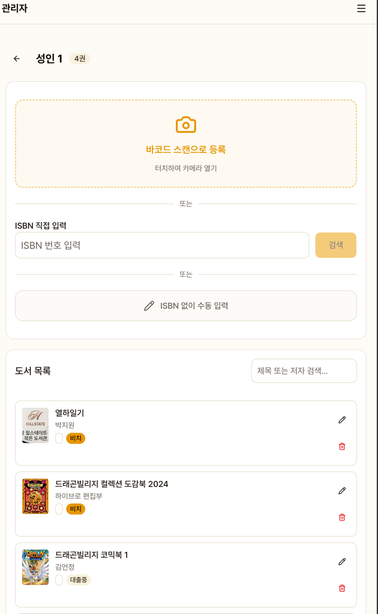
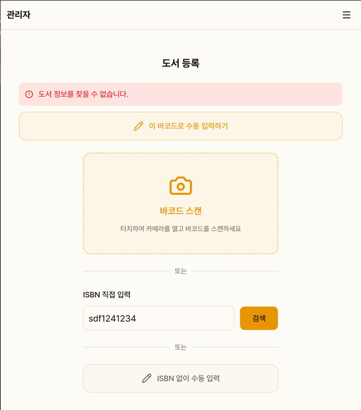
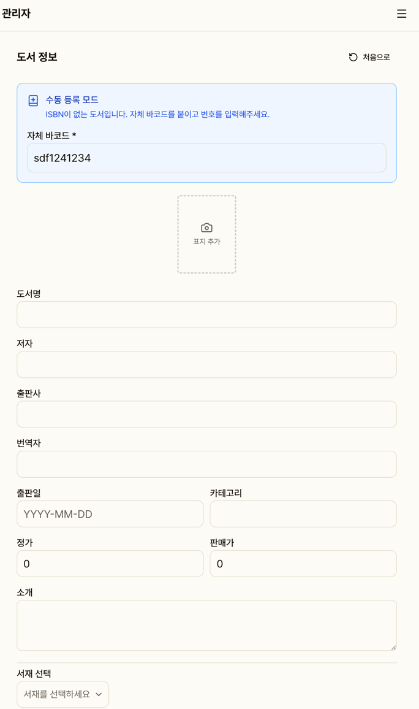
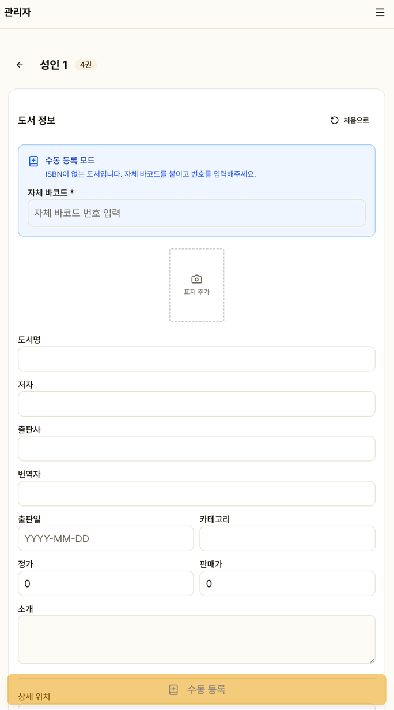
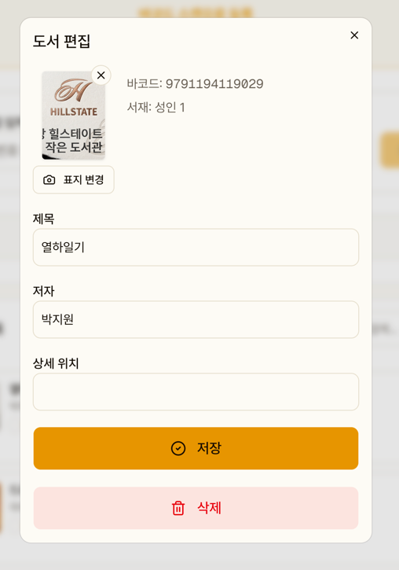

# 도서 등록

바코드 스캔으로 빠르게 등록하거나, 수동으로 직접 입력할 수 있습니다.

## 등록 방법

### 1. 바코드 스캔 등록 (추천)

1. **바코드 스캔** 버튼 → 카메라로 책 뒷면 바코드 스캔
2. 카카오 도서 검색 API가 자동으로 도서 정보를 불러옵니다
3. 서재 선택 + 상세 위치 입력
4. **도서 등록** 클릭

### 2. ISBN 직접 입력

바코드 스캔이 안 되는 경우 ISBN 번호를 직접 입력하여 검색합니다.

### 3. 카카오에서 못 찾는 경우

검색 실패 시 **"이 바코드로 수동 입력하기"** 버튼이 나타납니다.
클릭하면 바코드가 자동 입력된 상태로 수동 등록 폼에 진입합니다.

### 4. ISBN 없는 도서 수동 등록

- **"ISBN 없이 수동 입력"** 버튼으로 완전 수동 모드 진입
- 자체 바코드 번호 입력
- 도서명, 저자, 출판사 등 직접 입력
- **표지 이미지**: 카메라 촬영 또는 사진첩에서 업로드

## 복본 등록

이미 등록된 바코드를 스캔하면 경고가 표시됩니다.
자체 바코드 스티커를 붙이고 번호를 입력하여 복본을 등록합니다.

## 개별 대여 기간

도서별로 기본 대여 기간과 다른 기간을 설정할 수 있습니다 (선택사항).

## 도서 편집

서가별 도서 목록에서 도서를 터치하면 편집 다이얼로그가 열립니다.

- 제목, 저자, 출판사, 위치 수정
- 표지 이미지 변경/삭제
- 도서 삭제 (대출 중인 도서는 삭제 불가)
