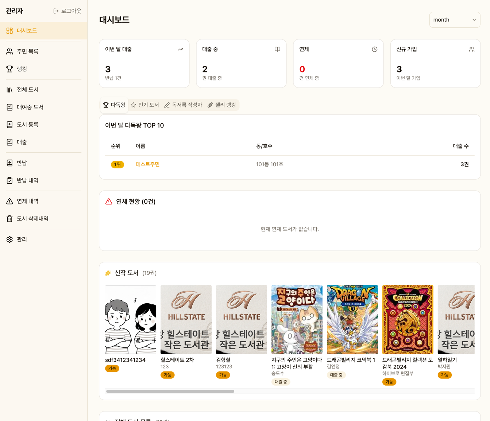
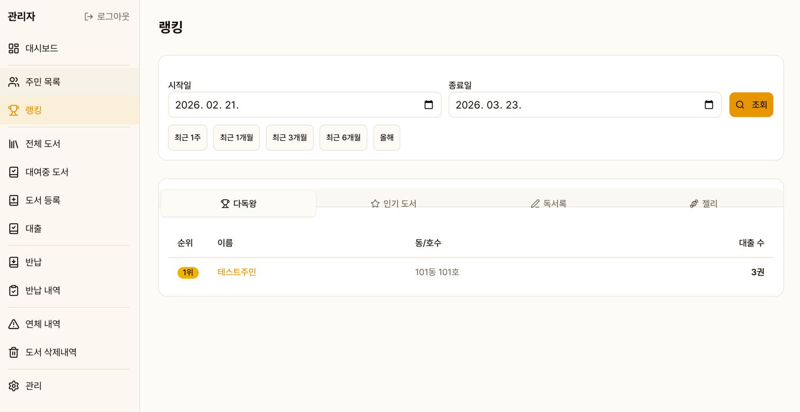

# 대시보드

관리자 로그인 후 첫 화면입니다. 도서관 전체 현황을 한눈에 파악할 수 있습니다.

## 기간별 통계

날짜 범위를 설정하여 통계를 조회합니다.

- 대출 건수
- 반납 건수
- 신규 가입자 수

## 랭킹 (4개 탭)

| 탭 | 내용 |
|----|------|
| 다독왕 | 가장 많이 대출한 주민 |
| 인기 도서 | 가장 많이 대출된 도서 |
| 독서록 | 독서록을 많이 작성한 주민 |
| 젤리 | 젤리를 많이 획득한 주민 |

## 연체 현황

현재 연체 중인 도서 목록이 표시됩니다.

## 신작 도서

최근 등록된 도서가 표시됩니다. 기준 일수는 설정에서 변경 가능합니다.

## 전체 도서 목록

도서관에 등록된 모든 도서의 간략 테이블입니다.
