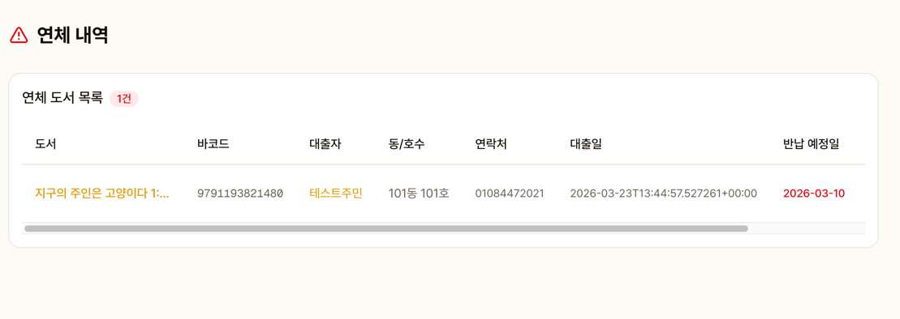

# 연체 관리

연체 중인 도서를 관리하고 알림을 발송합니다.

## 연체 목록

현재 연체 중인 모든 도서가 표시됩니다.

| 항목 | 설명 |
|------|------|
| 도서명 | 연체 도서 (클릭 시 상세) |
| 대출자 | 이름 / 동호수 (클릭 시 주민 상세) |
| 대출일 | 대출 처리 날짜 |
| 반납 기한 | 원래 반납 예정일 |
| 연체 일수 | 경과 일수 |
| 알림 | 발송 상태 |

## 알림 발송

- **7일 연체**: 7일 연체 알림 발송 가능
- **30일 연체**: 30일 연체 알림 발송 가능

발송된 알림은 `notifications` 테이블에 기록됩니다.

::: info
현재 앱 내 알림으로 제공됩니다. SMS/알림톡 연동은 추후 지원 예정입니다.
:::

## 대출 제한

연체 중인 주민은 신규 대출이 자동으로 제한됩니다.
셀프 대여와 관리자 대출 모두 차단됩니다.
