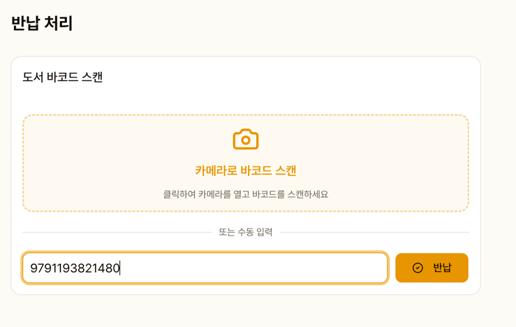
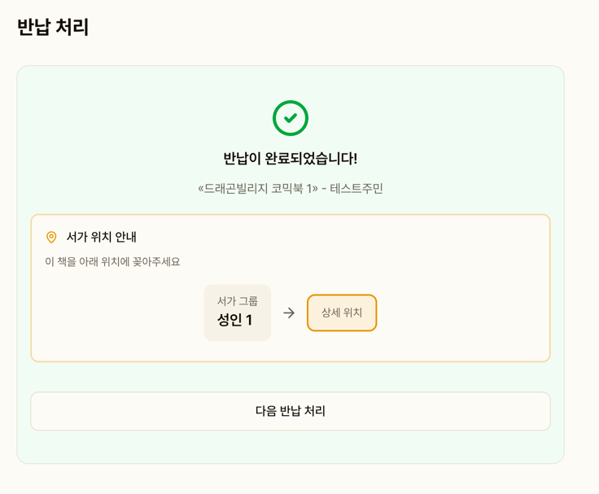
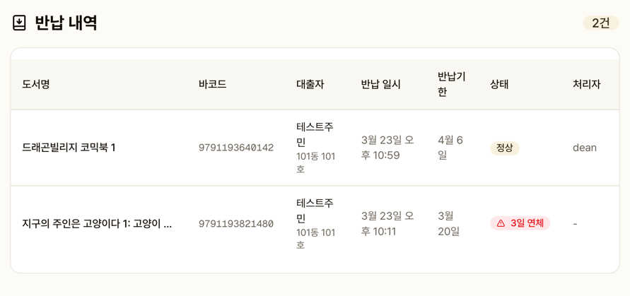

# 대출 / 반납

관리자가 대출과 반납을 처리하는 화면입니다.

## 대출 처리

### 절차

1. **주민 검색**: 이름 또는 동호수로 검색 → 선택
2. **도서 스캔**: 바코드 스캔 또는 수동 입력
3. 대출 처리 완료

::: warning 대출 제한
- 연체 중인 주민은 대출이 **제한**됩니다
- 1인당 최대 대출 권수 초과 시 대출이 **제한**됩니다
:::

::: tip 젤리 지급
대출 시 주민에게 **+5 젤리**가 자동 지급됩니다.
:::

## 반납 처리

### 절차

1. **도서 스캔**: 바코드 스캔 또는 수동 입력
2. 반납 즉시 처리
3. **서가 위치 팝업** 표시 — SVG 미니맵으로 꽂을 위치 안내
4. 연체 여부 + 연체 일수 표시

### 반납 처리자 기록

어떤 관리자가 반납 처리했는지 자동으로 기록됩니다.

::: tip 젤리 지급
반납 시 주민에게 **+5 젤리**가 자동 지급됩니다.
:::

## 반납 내역

최근 반납 완료된 도서 목록을 조회합니다 (최대 200건).

| 항목 | 설명 |
|------|------|
| 도서명 | 반납된 도서 |
| 바코드 | 도서 바코드 |
| 대출자 | 이름 / 동호수 |
| 반납 일시 | 반납 처리 날짜와 시각 |
| 반납 기한 | 원래 반납 예정일 |
| 상태 | 정상 또는 N일 연체 |
| 처리자 | 반납 처리한 관리자 |

## 대여중 도서 목록

현재 대출 중인 전체 도서 목록을 확인합니다. 반납 기한이 포함됩니다.
