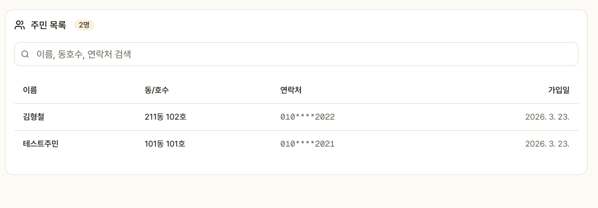
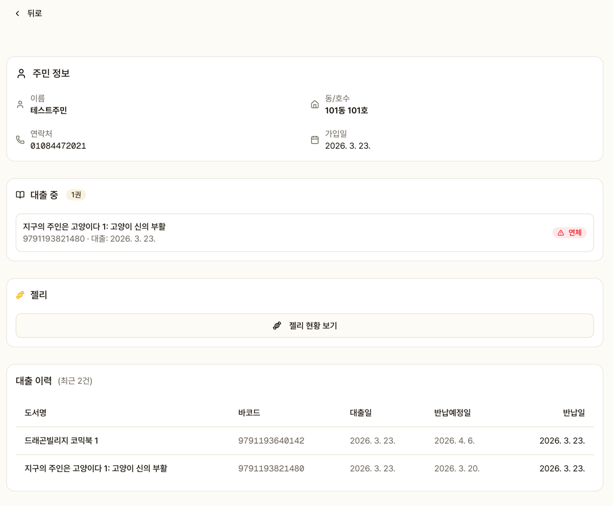
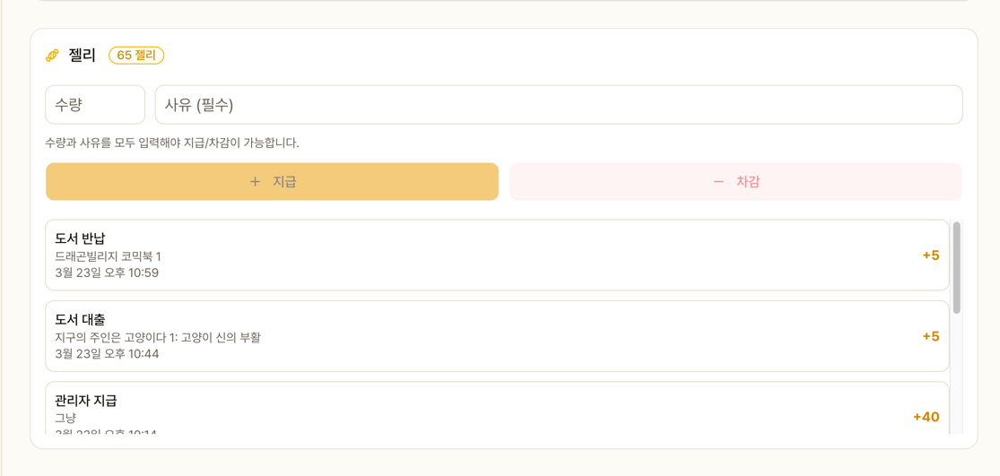

# 주민 관리

주민 목록 조회와 개별 주민의 상세 정보를 확인합니다.

## 주민 목록

- 전체 주민 검색 (이름, 동호수)
- 연락처는 마스킹 처리 (`010-****-1234`)
- 클릭 시 주민 상세 페이지로 이동

## 주민 상세

### 프로필

이름, 동호수, 연락처, 가입일

### 현재 대출 중

대출 중인 도서 목록과 반납 기한이 표시됩니다.
연체 도서는 빨간색으로 강조됩니다.

### 젤리 현황

- 현재 잔액
- 젤리 이력 (획득/차감 내역)
- **수동 지급**: 수량 + 사유 입력 후 지급
- **수동 차감**: 수량 + 사유 입력 후 차감

::: warning
수량과 사유를 모두 입력해야 지급/차감 버튼이 활성화됩니다.
:::

### 대출 이력

과거 대출/반납 기록을 확인합니다. 도서 클릭 시 도서 상세로 이동합니다.
