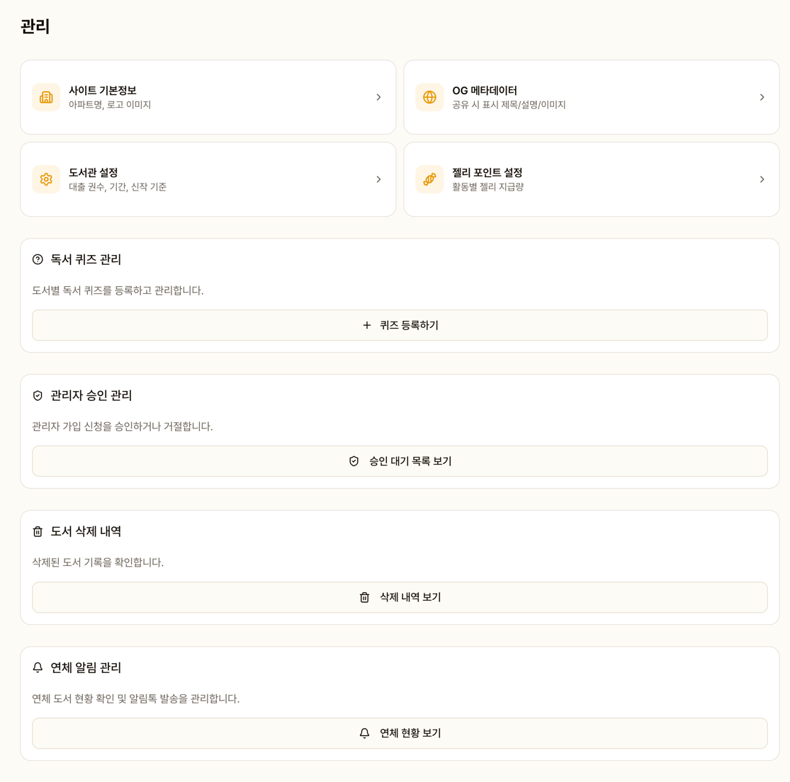
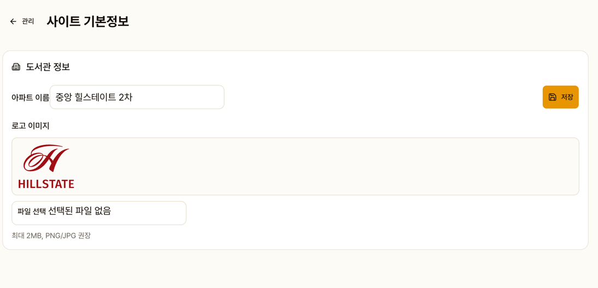
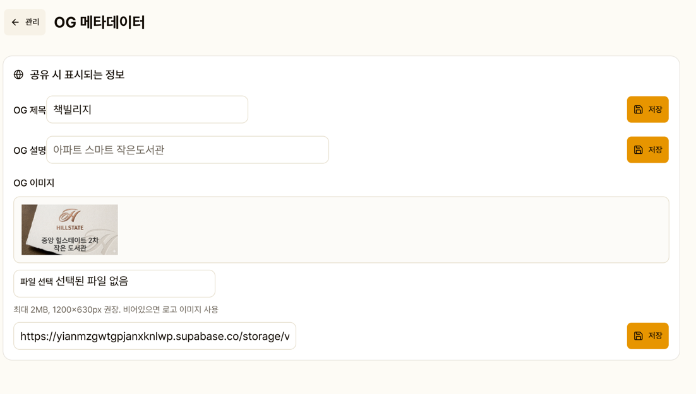
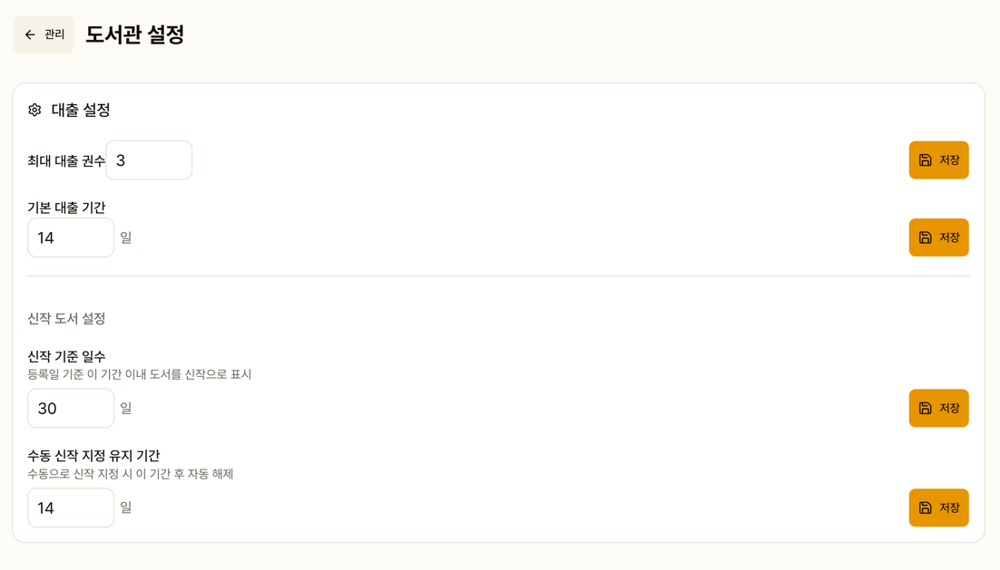
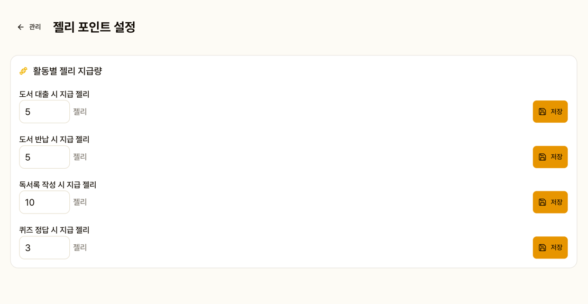

# 설정

도서관 운영에 필요한 다양한 설정을 관리합니다.

## 사이트 설정

- **아파트(도서관) 이름**: 대여 화면 상단에 표시

- **로고 이미지**: 업로드하여 사이트 전체에 적용
- **OG 메타데이터**: 카카오톡 등에서 공유 시 표시될 제목, 설명, 이미지

## 도서관 설정

| 설정 | 기본값 | 설명 |
|------|--------|------|
| 1인당 최대 대출 권수 | 3권 | 초과 시 대출 제한 |
| 기본 대출 기간 | 14일 | 도서별 개별 설정 가능 |
| 신작 도서 기준 일수 | 30일 | 대시보드 신작 섹션 |
| 수동 신작 유지 기간 | 7일 | 수동 지정한 신작 표시 기간 |

## 젤리 포인트 설정

| 활동 | 기본값 |
|------|--------|
| 도서 대출 | +5 |
| 도서 반납 | +5 |
| 독서록 작성 | +10 |
| 퀴즈 정답 | +3 |

## 퀴즈 관리

도서별 퀴즈를 등록, 편집, 삭제합니다.
객관식 문제와 정답을 설정합니다.

## 관리자 승인

새로 가입 신청한 관리자를 승인하거나 거절합니다.
승인된 관리자만 로그인이 가능합니다.
