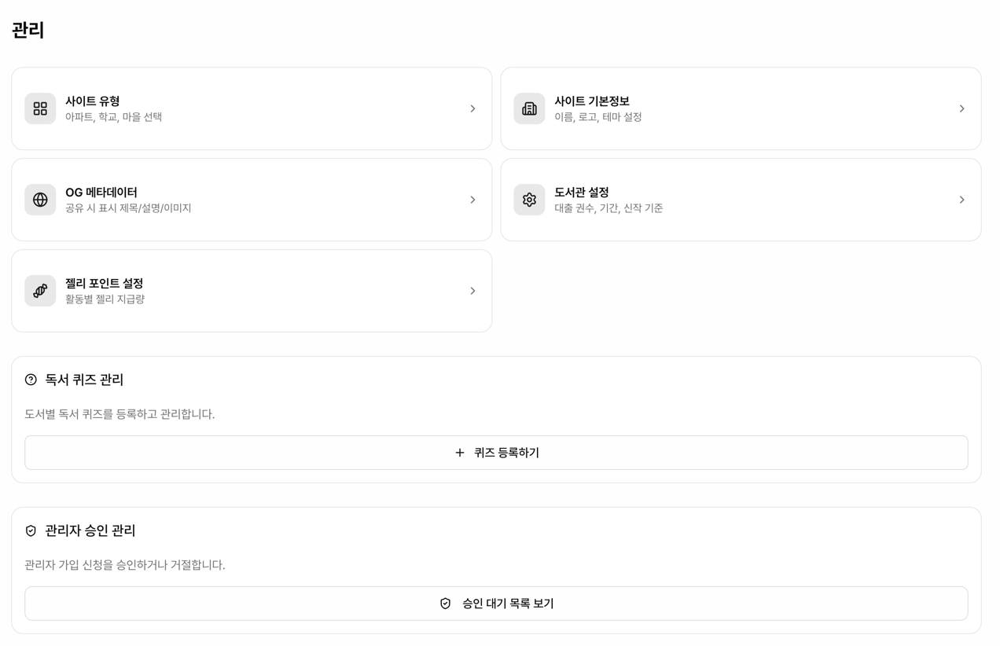
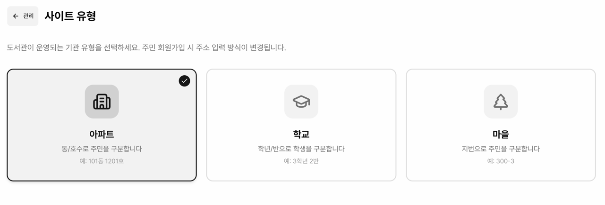
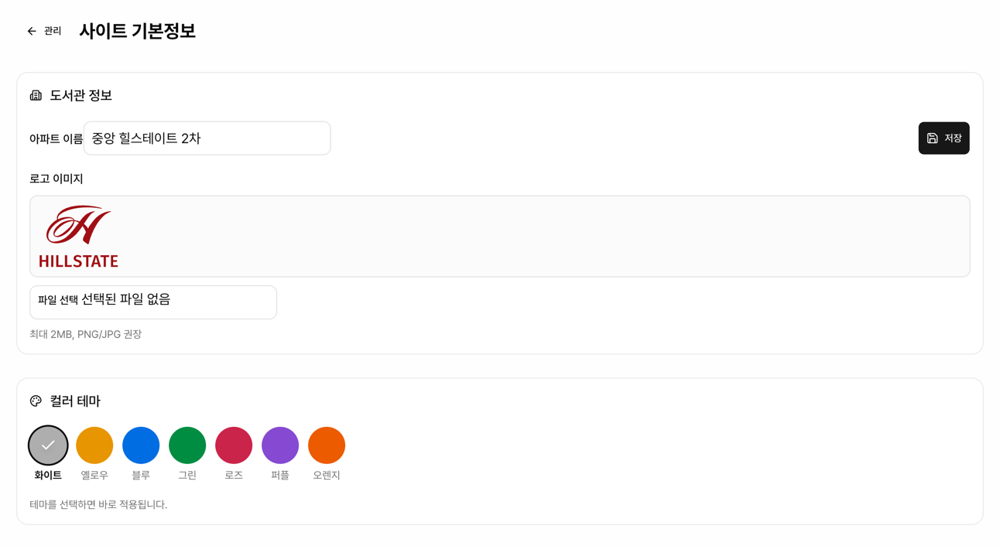
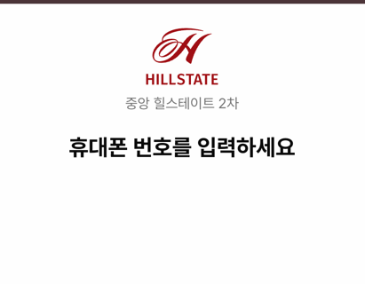
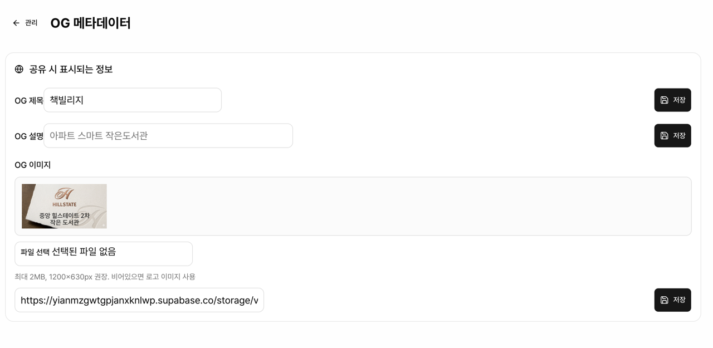
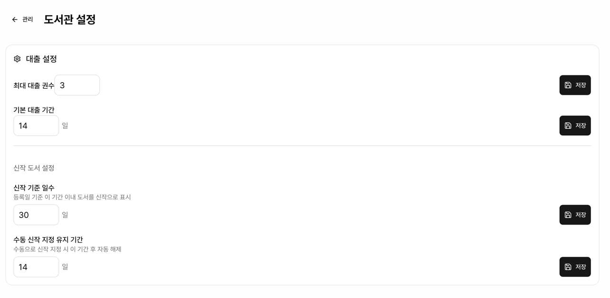
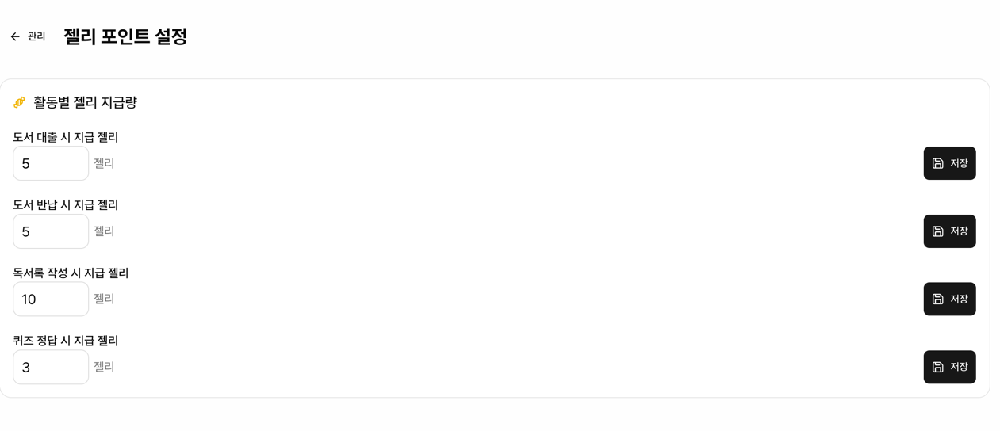

# 설정

관리 페이지(`/admin/manage`)에서 도서관 운영에 필요한 모든 설정을 관리합니다.

상단에 5개의 설정 메뉴 카드가 있고, 하단에 퀴즈 관리, 관리자 승인, 삭제 내역, 연체 알림 섹션이 있습니다.

## 설정 메뉴

| 메뉴 | 경로 | 설명 |
|------|------|------|
| 사이트 유형 | `/admin/manage/site-type` | 아파트, 학교, 마을 선택 |
| 사이트 기본정보 | `/admin/manage/site` | 이름, 로고, 테마 설정 |
| OG 메타데이터 | `/admin/manage/og` | 공유 시 표시 제목/설명/이미지 |
| 도서관 설정 | `/admin/manage/library` | 대출 권수, 기간, 신작 기준 |
| 젤리 포인트 설정 | `/admin/manage/jelly` | 활동별 젤리 지급량 |

---

## 사이트 유형

경로: `/admin/manage/site-type`

도서관이 운영되는 기관 유형을 선택합니다. 선택한 유형에 따라 주민 회원가입 시 주소 입력 방식이 자동으로 변경됩니다.

<!-- 사이트 유형 선택 페이지 스크린샷 -->

| 유형 | 아이콘 | 주소 체계 | 예시 |
|------|--------|-----------|------|
| 아파트 | Building2 | 동 / 호 | 101동 1201호 |
| 학교 | GraduationCap | 학년 / 반 | 3학년 2반 |
| 마을 | TreePine | 지번 (자유 입력) | 300-3 |

- 큰 카드 UI로 직관적으로 선택
- 선택 즉시 자동 저장
- 선택된 유형은 테두리 강조 + 체크 배지 표시

---

## 사이트 기본정보

경로: `/admin/manage/site`

### 도서관 이름

사이트 유형에 따라 라벨이 자동 변경됩니다:
- 아파트 → "아파트 이름" (예: 책마을아파트)
- 학교 → "학교 이름" (예: 책마을초등학교)
- 마을 → "마을 이름" (예: 책마을)

로그인 화면 상단과 대여하기 화면에 표시됩니다.

<!-- 사이트 기본정보 페이지 스크린샷 -->

### 로고 이미지

로고를 업로드하면 로그인 화면에 표시됩니다.
- 최대 2MB, PNG/JPG 권장
- 업로드 즉시 Supabase Storage에 저장

### 컬러 테마

7가지 컬러 테마 중 선택하여 도서관만의 개성을 표현할 수 있습니다.

<!-- 컬러 테마 선택 스크린샷 -->

| 테마 | 설명 |
|------|------|
| 화이트 | 무채색 모노톤 |
| 옐로우 | 따뜻한 노란색 (기본) |
| 블루 | 차분한 파란색 |
| 그린 | 자연의 초록색 |
| 로즈 | 부드러운 분홍색 |
| 퍼플 | 고급스러운 보라색 |
| 오렌지 | 활기찬 주황색 |

- 원형 버튼 클릭으로 선택
- **실시간 미리보기**: 선택 즉시 전체 사이트 UI에 테마가 적용됩니다 (페이지 새로고침 불필요)
- 선택과 동시에 자동 저장
- oklch 컬러 스페이스 기반으로 라이트/다크 모드 모두 지원

---

## OG 메타데이터

경로: `/admin/manage/og`

카카오톡 등 SNS에서 사이트 링크를 공유할 때 표시되는 정보를 설정합니다.

<!-- OG 메타데이터 설정 스크린샷 -->

| 항목 | 설명 |
|------|------|
| OG 제목 | 공유 시 표시되는 제목 (기본: 책빌리지) |
| OG 설명 | 공유 시 표시되는 설명 |
| OG 이미지 | 공유 시 표시되는 이미지 (1200x630px 권장) |

- 이미지는 파일 업로드 또는 URL 직접 입력 가능
- 비어있으면 로고 이미지를 대신 사용

---

## 도서관 설정

경로: `/admin/manage/library`

대출과 신작 관련 운영 설정을 관리합니다.

<!-- 도서관 설정 페이지 스크린샷 -->

### 대출 설정

| 설정 | 기본값 | 범위 | 설명 |
|------|--------|------|------|
| 최대 대출 권수 | 5권 | 1~20 | 초과 시 추가 대출 제한 |
| 기본 대출 기간 | 14일 | 1~90 | 도서별 개별 설정으로 오버라이드 가능 |

### 신작 도서 설정

| 설정 | 기본값 | 범위 | 설명 |
|------|--------|------|------|
| 신작 기준 일수 | 30일 | 1~365 | 등록일 기준 이 기간 이내를 신작으로 표시 |
| 수동 신작 유지 기간 | 14일 | 1~90 | 수동으로 신작 지정 시 이 기간 후 자동 해제 |

---

## 젤리 포인트 설정

경로: `/admin/manage/jelly`

독서 활동에 대한 젤리 포인트 지급량을 설정합니다.

<!-- 젤리 포인트 설정 스크린샷 -->

| 활동 | 기본값 | 범위 |
|------|--------|------|
| 도서 대출 | +5 젤리 | 0~100 |
| 도서 반납 | +5 젤리 | 0~100 |
| 독서록 작성 | +10 젤리 | 0~100 |
| 퀴즈 정답 | +3 젤리 | 0~100 |

---

## 퀴즈 관리

관리 페이지 하단에서 도서별 독서 퀴즈를 등록합니다.

1. **퀴즈 등록하기** 버튼 클릭
2. 도서 검색 후 선택
3. 질문, 4개 선택지, 정답 입력
4. 등록 완료

- 주민은 반납 완료 후 퀴즈를 풀 수 있습니다
- 1인 1회 풀이 제한
- 정답 시 젤리 지급

---

## 관리자 승인

관리자 가입 신청(`/admin/register`) 목록을 확인하고 승인/거절합니다.

- **승인 대기 목록 보기** 버튼으로 목록 로드
- 승인: 해당 관리자 로그인 가능
- 거절: Auth 계정까지 삭제

---

## 도서 삭제 내역

삭제된 도서의 감사 로그를 확인합니다.

| 정보 | 설명 |
|------|------|
| 도서명 | 삭제 시점의 도서명 |
| 저자 | 삭제 시점의 저자 |
| 바코드 | 삭제 시점의 바코드 |
| 삭제자 | 삭제를 처리한 관리자 |
| 삭제일 | 삭제 일시 |

---

## 연체 알림 관리

현재 연체 중인 도서 목록을 확인합니다.

| 정보 | 설명 |
|------|------|
| 주민 | 이름, 동호수 |
| 도서명 | 연체 중인 도서 |
| 연체일 | 연체 경과 일수 |
| 알림 | 7일/30일차 알림 발송 여부 |
