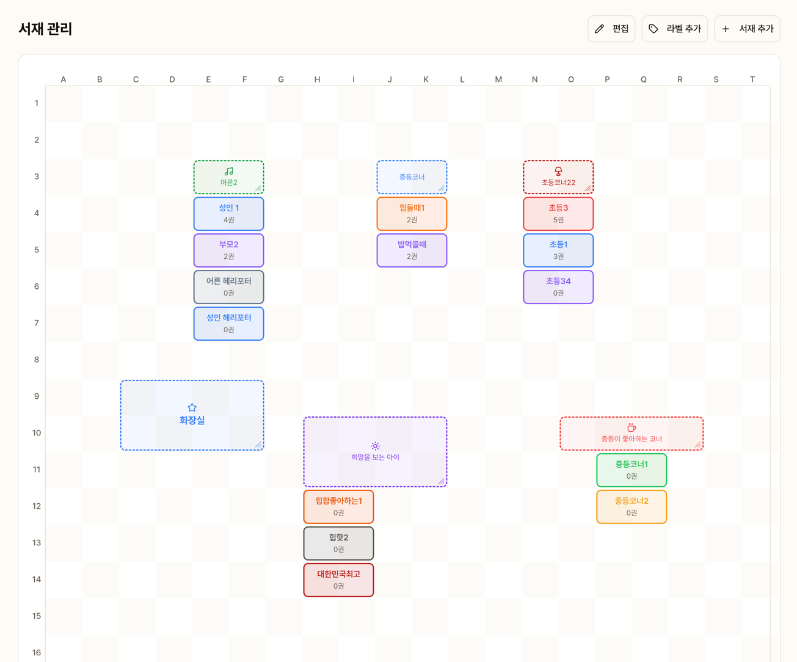
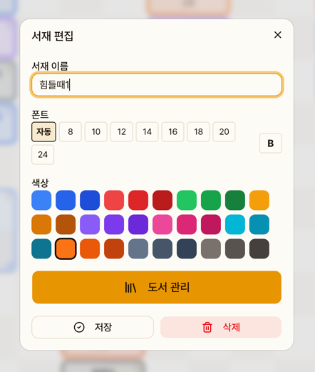
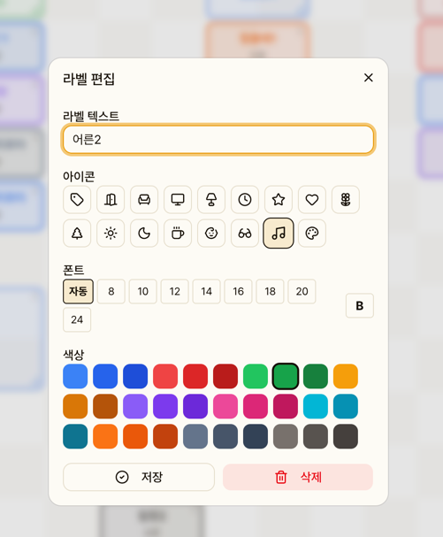
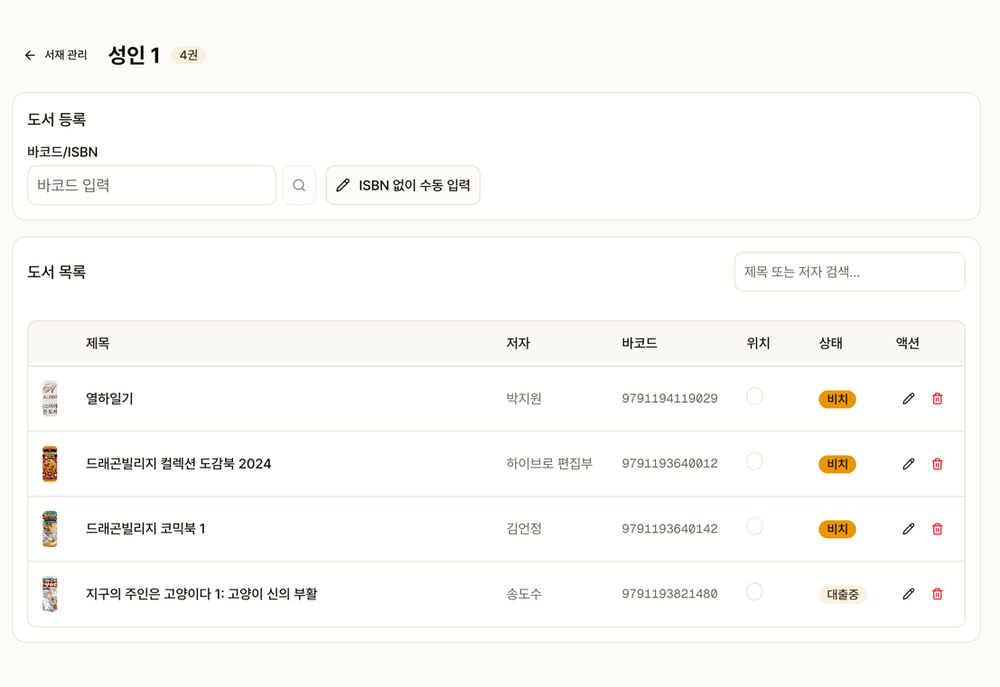
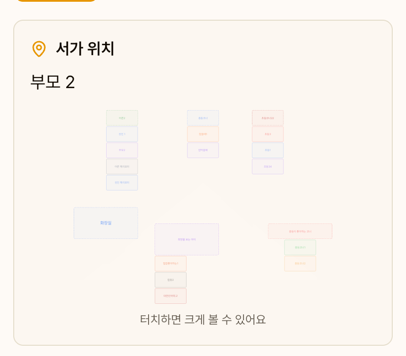

# 서가 관리

도서관 서가 배치를 SVG 그리드로 시각적으로 관리합니다.

## 서가 그리드

서가와 라벨을 그리드에 배치하여 도서관 레이아웃을 구성합니다.

### 서가/라벨 추가

- **서가**: 도서가 배치되는 칸 (도서 등록 시 선택 가능)

- 
- **라벨**: 안내 문구, 장식 등 (도서 배치 불가)

### 서가 설정

| 항목 | 설명 |
|------|------|
| 이름 | 서가 이름 (예: "아동 1", "부모 2") |
| 위치 | 그리드 X/Y 좌표 |
| 크기 | 가로/세로 칸 수 |
| 색상 | 서가 표시 색상 |
| 폰트 크기 | 서가명 텍스트 크기 |
| 볼드 | 텍스트 굵기 |

## 서가별 도서 목록

서가를 클릭하면 해당 서가에 배치된 도서 목록이 표시됩니다.

- 도서 검색
- 도서 터치 → 편집/삭제
- 새 도서 등록 (바코드 스캔 or 수동)

## SVG 미니맵

반납 처리 시, 주민 도서 상세 화면에서 서가 위치를 SVG 맵으로 안내합니다.
해당 서가가 깜빡이는 애니메이션으로 강조됩니다.

