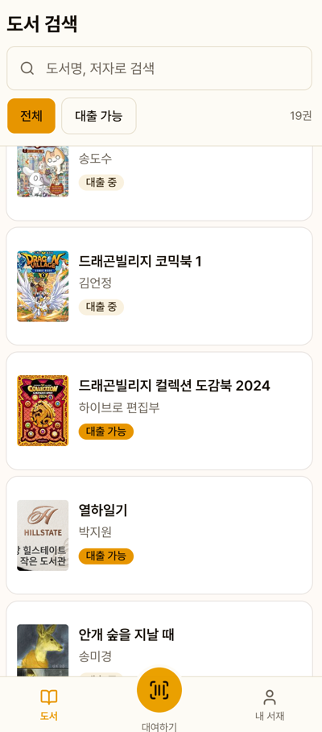
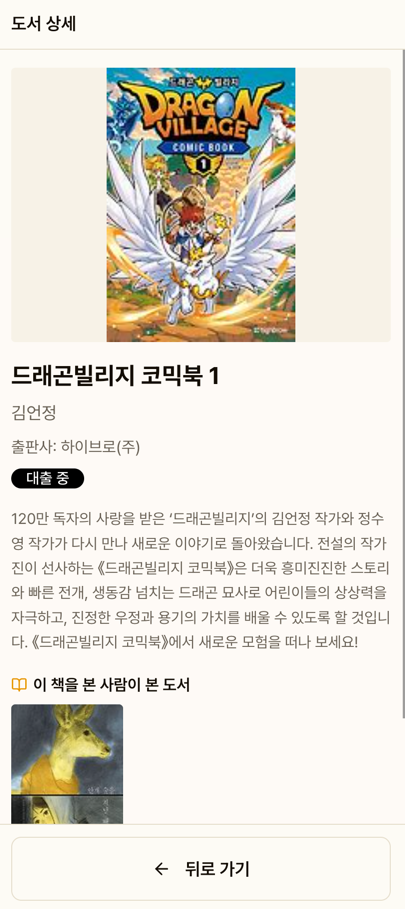
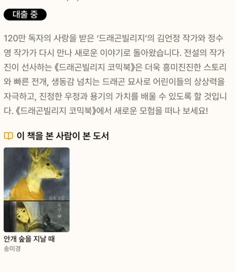
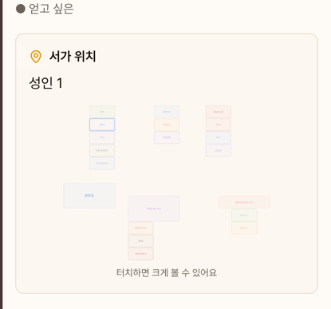
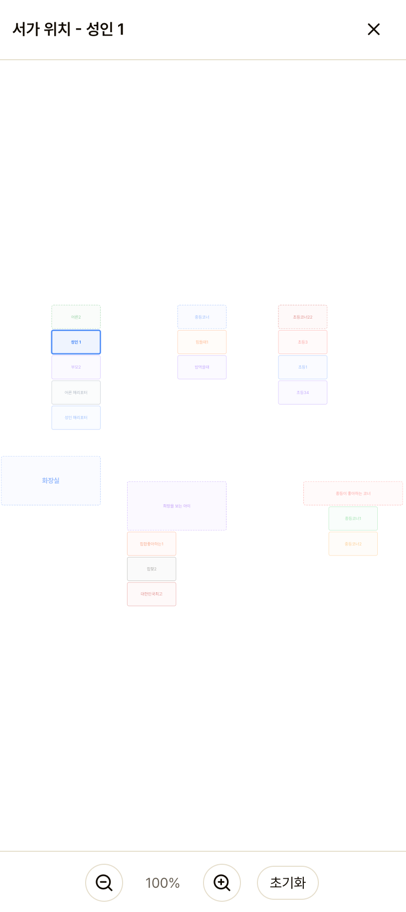
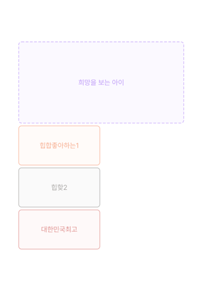

# 도서 검색

전체 도서를 검색하고, 상세 정보를 확인할 수 있습니다.

## 도서 목록

하단 네비게이션의 "도서" 탭에서 전체 도서 목록을 볼 수 있습니다.

### 검색

검색창에 도서명 또는 저자를 입력하면 실시간으로 필터링됩니다.

### 필터

- **전체**: 모든 도서 표시
- **대출 가능**: 현재 대출 가능한 도서만 표시

## 도서 상세

도서를 터치하면 전체 화면으로 상세 정보가 표시됩니다.

### 표시 정보

- 표지 이미지, 제목, 저자, 출판사
- 도서 소개글
- 대출 가능 여부 (대출 중일 때 반납 예정일 표시)
- **서가 위치** — 대출 가능 상태일 때만 SVG 맵으로 표시

### 추천 도서

"이 책을 본 사람이 본 도서" 섹션에서 관련 도서를 추천합니다.

### 서가 위치 맵

서가 위치를 터치하면 전체 화면으로 확대할 수 있습니다.
핀치 줌, 드래그로 자유롭게 탐색 가능합니다.

