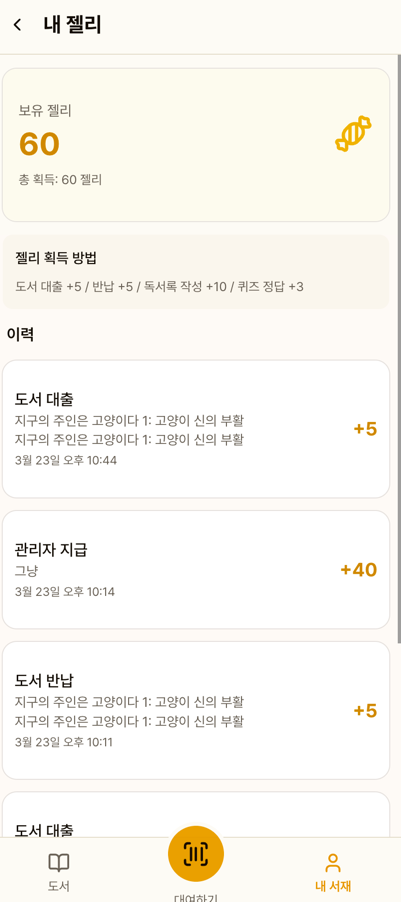

# 젤리 포인트

독서 활동을 장려하기 위한 포인트 시스템입니다.

## 젤리 획득 방법

| 활동 | 지급량 |
|------|--------|
| 도서 대출 | +5 젤리 |
| 도서 반납 | +5 젤리 |
| 독서록 작성 | +10 젤리 |
| 퀴즈 정답 | +3 젤리 |

::: info
지급량은 관리자가 설정에서 변경할 수 있습니다.
:::

## 내 젤리 화면

### 잔액 카드

보유 젤리와 총 획득량이 표시됩니다.

### 획득 방법 안내

각 활동별 젤리 지급량이 안내됩니다.

### 이력

날짜별 젤리 획득/차감 내역을 확인할 수 있습니다.
각 이력에는 사유와 관련 도서명이 표시됩니다.

## 관리자 수동 지급/차감

관리자가 주민 상세 페이지에서 수동으로 젤리를 지급하거나 차감할 수 있습니다.
수량과 사유를 입력해야 합니다.
