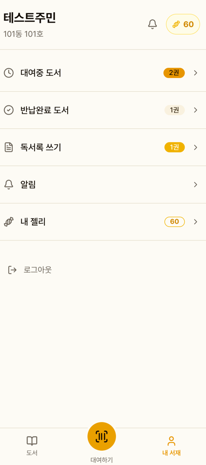
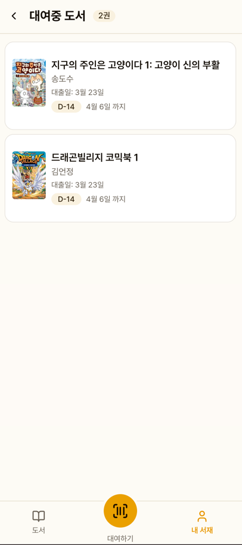
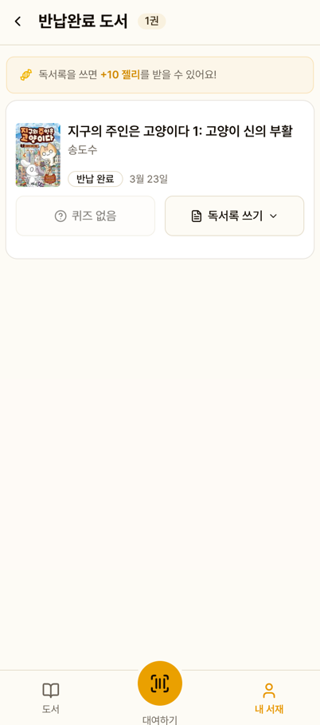

# 내 서재

로그인한 주민의 대출 현황, 반납 이력, 독서 활동을 관리하는 공간입니다.

## 메인 화면

### 표시 정보

- 이름, 동호수
- 알림 아이콘 (미읽은 알림 수 배지)
- 보유 젤리 잔액
- 연체 도서가 있으면 경고 배너

### 메뉴

| 메뉴 | 설명 |
|------|------|
| 대여중 도서 | 현재 대출 중인 도서 |
| 반납완료 도서 | 반납된 도서 (퀴즈/독서록) |
| 알림 | 반납 알림, 연체 알림 |
| 내 젤리 | 젤리 잔액 및 이력 |

## 대여중 도서

- 커버 이미지, 제목, 저자
- 반납 기한까지 남은 일수 (**D-N** 배지)
- 연체 시 빨간색 **연체** 배지
- 터치하면 도서 상세로 이동

## 반납완료 도서

반납된 도서에서 퀴즈 풀기와 독서록 쓰기가 가능합니다.
자세한 내용은 [퀴즈 & 독서록](/features/quiz-report) 페이지를 참고하세요.

## 로그아웃

화면 하단의 로그아웃 버튼으로 로그아웃합니다.
