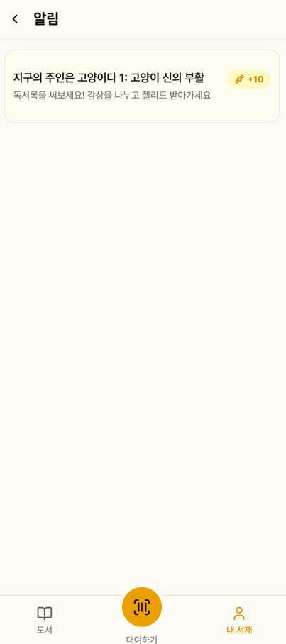
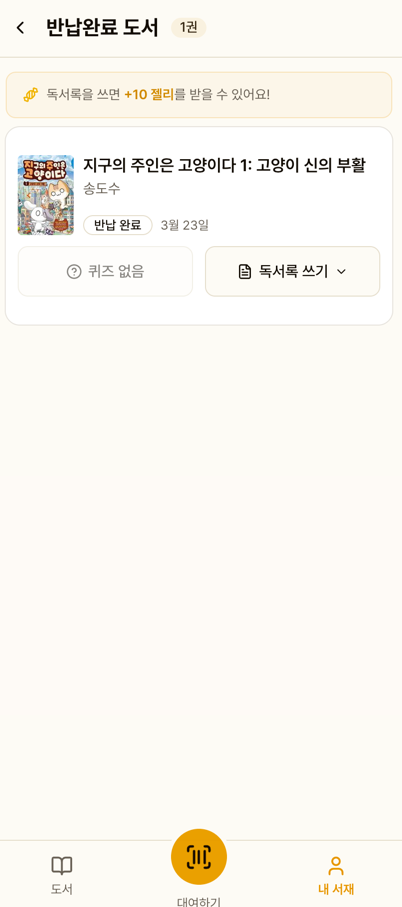

# 알림

대출/반납 관련 알림을 자동으로 제공합니다.

## 알림 종류

| 알림 | 시점 | 색상 |
|------|------|------|
| 반납 예정 | 반납일 3일 전 | 파란색 |
| 당일 반납 | 반납일 당일 | 노란색 |
| 연체 | 반납일 경과 | 빨간색 |
| 독서록 권유 | 반납 후 미작성 시 | 초록색 |

## 알림 화면

### 알림 배지

내 서재의 알림 아이콘에 미읽은 알림 수가 배지로 표시됩니다.
알림 페이지 진입 시 읽음 처리됩니다.

### 독서록 권유

미작성 도서에 대해 "독서록을 써보세요!" 카드가 표시됩니다.
터치하면 반납완료 페이지로 이동합니다.

