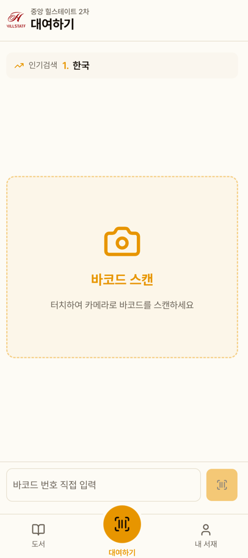
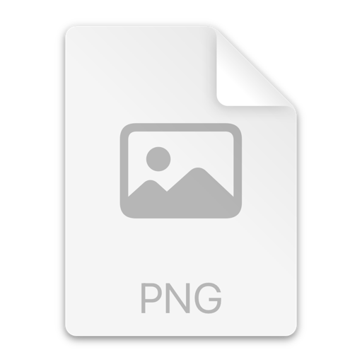
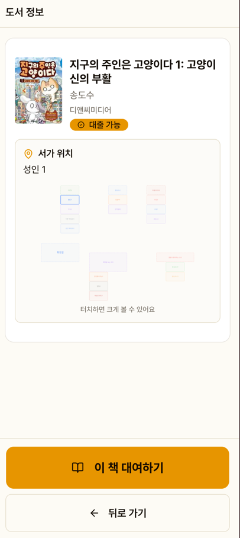
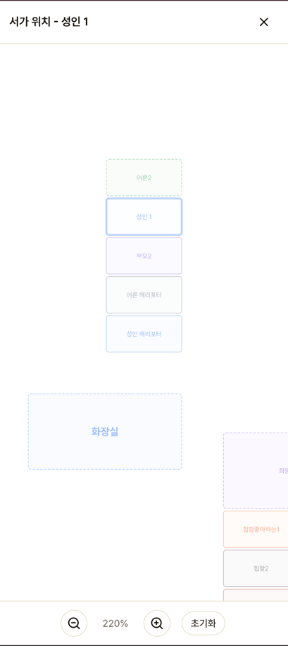
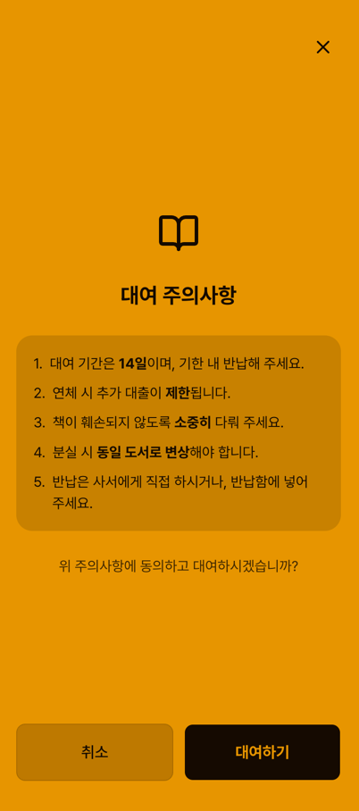
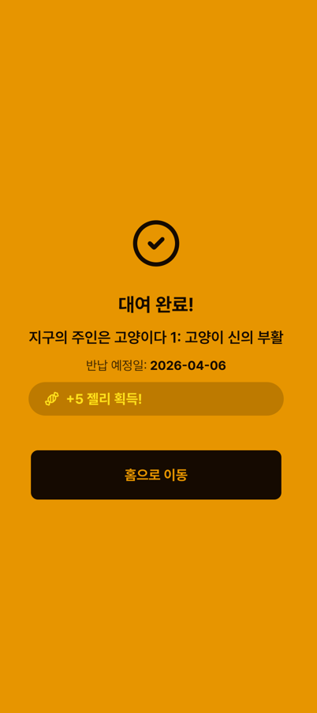
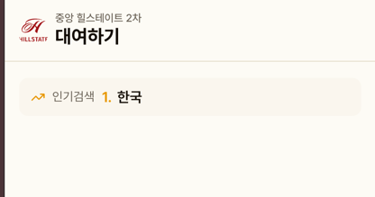

# 대여하기

주민이 직접 바코드를 스캔하여 도서를 대출하는 셀프 대여 기능입니다.

## 화면 구성

대여 화면 상단에는 도서관 로고와 아파트 이름이 표시됩니다.

## 바코드 스캔

화면 중앙의 바코드 스캔 버튼을 터치하면 카메라가 열립니다.
책 뒷면의 바코드를 카메라에 비추면 자동으로 인식됩니다.

### 카메라 접근 불가 시

카메라 권한이 차단된 경우 설정 방법 안내가 표시됩니다.

### 수동 입력

카메라를 사용할 수 없는 경우, 화면 하단 입력칸에 바코드 번호를 직접 입력할 수 있습니다.

## 도서 정보 확인

바코드 인식 후 도서 정보가 표시됩니다:
- 표지, 제목, 저자, 출판사
- 대출 가능 여부
- 서가 위치 (SVG 미니맵)

## 대출 진행

"이 책 대여하기" 버튼을 누르면 주의사항 안내가 표시됩니다.

동의 후 대출이 처리되면 완료 화면이 표시됩니다.

::: tip 젤리 획득
대출 완료 시 **+5 젤리**가 자동 지급됩니다.
:::

## 인기 검색어

대여 화면에 다른 주민들이 많이 검색한 도서명이 롤링 형태로 표시됩니다.

