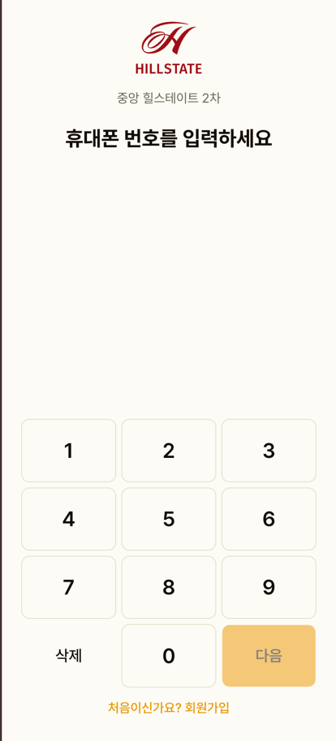
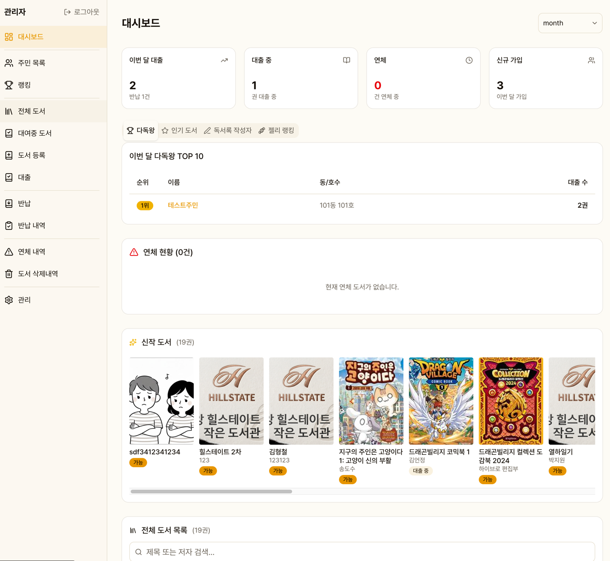

## 만든 이유

아이를 키우는 아빠로서 동네 작은도서관을 자주 이용합니다. 그런데 관리할 사람이 없어 문을 닫거나 운영을 중단하는 곳이 점점 많아지고 있었습니다.

디지털 시대에 아날로그로 운영되는 도서관은 사서(자원봉사자)에게 큰 부담이 됩니다. 수기 장부나 엑셀로 대출/반납을 기록하고, 연체를 관리하고, 도서를 정리하는 일은 꾸준히 누군가의 시간과 노력을 요구합니다. 그래서 포기하게 되는 것이죠.

하지만 아이들에게 도서관은 특별한 공간입니다. 책을 만지고, 고르고, 읽는 경험은 어떤 디지털 콘텐츠로도 대체할 수 없습니다.

그래서 직접 이 시스템을 개발했습니다. **Vercel + Supabase 무료 플랜**으로 **관리비 0원**, 스마트폰만 있으면 누구나 사서가 될 수 있고, 주민은 간편 로그인 후 셀프 대여까지 할 수 있습니다. 관리사무소를 찾아가 직접 소개하고, 지금 실제로 운영 중입니다.

아이들이 책을 더 재밌게 읽을 수 있도록 **독서 퀴즈**와 **젤리 포인트**도 만들었습니다. 책을 빌리고, 반납하고, 퀴즈를 풀고, 독서록을 쓰면 젤리가 쌓입니다. 작은 보상이지만 아이들은 "오늘 젤리 몇 개 모았어!"라며 즐거워합니다.

관리할 사람이 없어서 닫히는 도서관이 하나라도 줄었으면 합니다.

::: tip 함께 도서관을 살려요
이 프로젝트는 동네 작은 도서관이 더 오래 운영되기를 바라는 마음으로 만들었습니다. 지금은 실제 도서관에서 운영 중이며, 동네 작은 도서관이나 독립 책방에서도 사용할 수 있습니다. Vercel + Supabase 무료 플랜으로 **운영비 0원**이니 부담 없이 사용하시길 바랍니다. 환경에 맞게 커스터마이징이 필요하시면 언제든 연락 주세요. 직접 수정해 드리겠습니다.

📧 **hckim@dean.kr**
:::

## 기술 스택

| 영역 | 기술 |
|------|------|
| Frontend / Backend | Next.js 16 (App Router, TypeScript) |
| Database / Auth | Supabase (PostgreSQL) |
| UI | shadcn/ui + Tailwind CSS 4 |
| Deployment | Vercel (서울 리전) |
| External API | 카카오 도서 검색 API |
| Barcode | html5-qrcode |

## 스크린샷
### 주민용

### 관리자

## 개발

**딘스튜디오** | [dean.kr](https://dean.kr) | hckim@dean.kr

<!-- 스크린샷 추가 예시:

-->
